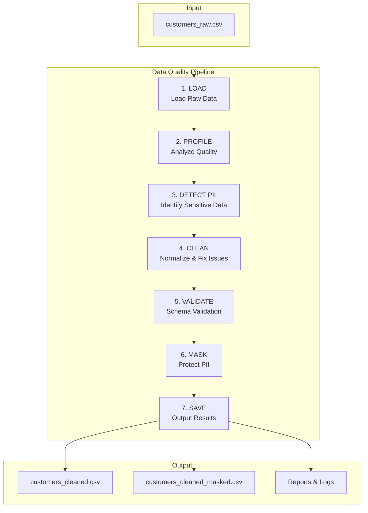
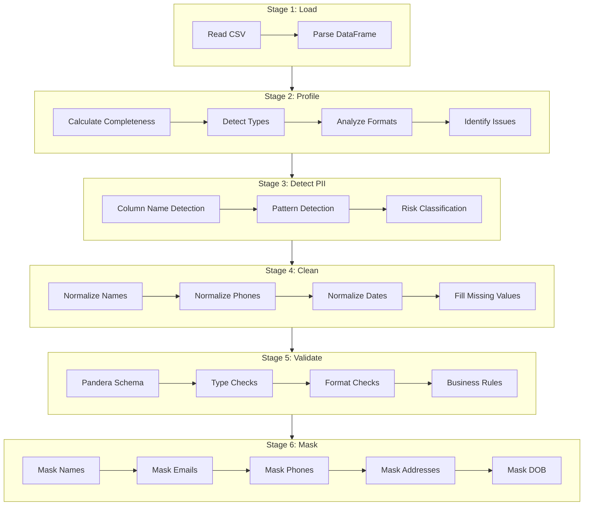

# Data Quality Validation Pipeline

A python pipeline for data profiling, PII detection, validation, cleaning, and masking of customer datasets.

## Overview

This pipeline provides an end-to-end solution for ensuring data quality and privacy compliance. It processes raw customer data through multiple stages, identifying issues, normalizing formats, validating against business rules, and protecting sensitive information.

## Architecture

### High-Level Pipeline Flow




### Data Flow Details



## Project Structure

```
Data_Quality_Validation/
├── config.yaml                 # Pipeline configuration
├── pytest.ini                  # Pytest settings
├── requirements.txt            # Python dependencies
├── data/
│   └── customers_raw.csv       # Raw input data
├── output/
│   ├── csv/
│   │   ├── customers_cleaned.csv
│   │   └── customers_cleaned_masked.csv
│   ├── reports/
│   │   ├── data_quality_report.txt
│   │   ├── pii_detection_report.txt
│   │   ├── validation_results.txt
│   │   ├── masked_sample.txt
│   │   └── pipeline_execution_report.txt
│   └── logs/
│       └── cleaning_log.txt
├── src/
│   ├── __init__.py
│   ├── config.py               # Configuration management
│   ├── logger.py               # Logging with rotation
│   ├── pipeline.py             # Main orchestrator
│   ├── profiler.py             # Data quality profiling
│   ├── pii_detector.py         # PII detection
│   ├── validator.py            # Pandera schema validation
│   ├── cleaner.py              # Data normalization
│   └── masker.py               # PII masking
├── tests/
│   ├── conftest.py             # Pytest fixtures
│   ├── test_profiler.py
│   ├── test_pii_detector.py
│   ├── test_validator.py
│   ├── test_cleaner.py
│   ├── test_masker.py
│   └── test_config.py
├── learning_guidance.md
└── reflection.md
```

## Installation

```bash
pip install -r requirements.txt
```

### Dependencies

- **pandas**: Data manipulation and analysis
- **pandera**: Schema-based data validation
- **PyYAML**: Configuration file parsing
- **pytest**: Testing framework

## Usage

### Run the Complete Pipeline

```bash
cd src
python pipeline.py
```

### With Custom Paths

```bash
python pipeline.py --input path/to/data.csv --output path/to/output/
```

### Run Tests

```bash
# Run all tests
python -m pytest tests/ -v

# Run with coverage
python -m pytest tests/ --cov=src --cov-report=html
```

## Configuration

All settings are managed via `config.yaml` with environment variable overrides:

```yaml
pipeline:
  input_file: "data/customers_raw.csv"
  output_dir: "output"
  log_level: "INFO"

validation:
  name_min_length: 2
  name_max_length: 50
  max_income: 10000000
  valid_statuses: [active, inactive, suspended]

cleaning:
  phone_format: "XXX-XXX-XXXX"
  date_format: "%Y-%m-%d"
  missing_string_fill: "[UNKNOWN]"

masking:
  preserve_email_domain: true
  preserve_phone_last_digits: 4
  preserve_dob_year: true

logging:
  console_output: false
  rotation_type: "size"
  max_bytes: 10485760  # 10MB
  backup_count: 5
```

### Environment Variable Overrides

Override any config value using the `DQV_` prefix:

```bash
export DQV_LOG_LEVEL=DEBUG
export DQV_MAX_INCOME=5000000
```

With coverage:

```bash
python -m pytest tests/ --cov=src --cov-report=html
```

## Pipeline Stages

| Stage | Module | Description |
|-------|--------|-------------|
| 1. LOAD | `pipeline.py` | Read raw CSV data into DataFrame |
| 2. PROFILE | `profiler.py` | Analyze completeness, types, formats, identify issues |
| 3. DETECT PII | `pii_detector.py` | Identify personally identifiable information |
| 4. CLEAN | `cleaner.py` | Normalize formats, handle missing values |
| 5. VALIDATE | `validator.py` | Validate against Pandera schema rules |
| 6. MASK | `masker.py` | Protect PII while preserving data structure |
| 7. SAVE | `pipeline.py` | Output cleaned data and reports |

## Validation Rules

| Column | Type | Rules |
|--------|------|-------|
| customer_id | Integer | Unique, positive |
| first_name | String | Non-empty, 2-50 chars, alphabetic |
| last_name | String | Non-empty, 2-50 chars, alphabetic |
| email | String | Valid email format |
| phone | String | Valid phone (normalized to XXX-XXX-XXXX) |
| date_of_birth | Date | Valid date, YYYY-MM-DD |
| address | String | Non-empty, 10-200 chars |
| income | Numeric | Non-negative, <= $10M |
| account_status | String | active, inactive, or suspended |
| created_date | Date | Valid date, YYYY-MM-DD |

## PII Masking Formats

| Field | Example Before | Example After |
|-------|----------------|---------------|
| first_name | John | J*** |
| email | john@gmail.com | j***@gmail.com |
| phone | 555-123-4567 | ***-***-4567 |
| address | 123 Main St NYC | [MASKED ADDRESS] |
| date_of_birth | 1985-03-15 | 1985-**-** |

## Output Files

### CSV Outputs (`output/csv/`)
- `customers_cleaned.csv` - Cleaned data with normalized formats
- `customers_cleaned_masked.csv` - Cleaned data with PII masked

### Reports (`output/reports/`)
- `data_quality_report.txt` - Completeness, type analysis, issues found
- `pii_detection_report.txt` - PII columns identified with risk levels
- `validation_results.txt` - Schema validation results
- `masked_sample.txt` - Sample of masked data
- `pipeline_execution_report.txt` - Execution summary with timing

### Logs (`output/logs/`)
- `cleaning_log.txt` - Detailed cleaning actions taken

## Design Patterns

| Pattern | Location | Purpose |
|---------|----------|---------|
| Pipeline/Chain | pipeline.py | Sequential stage execution |
| Strategy | validator.py | Pandera schema-based validation |
| Factory | DataProfiler, PIIDetector | Create analysis objects |
| Dataclass | All modules | Structured data transfer |
| Configuration | config.py | Externalized settings with overrides |
| Decorator | logger.py | LogContext for timing operations |


