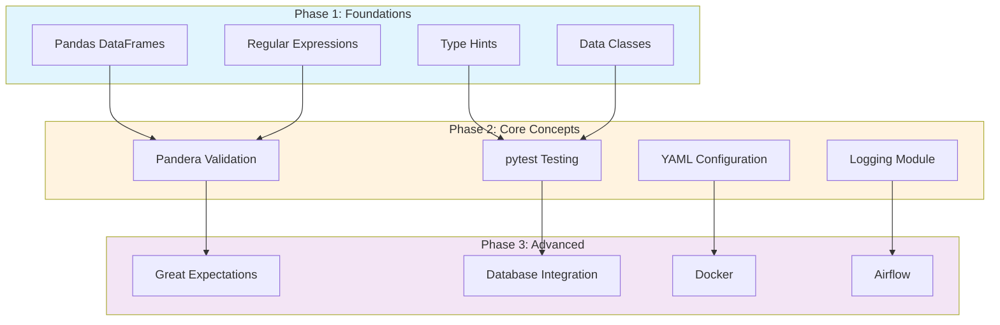
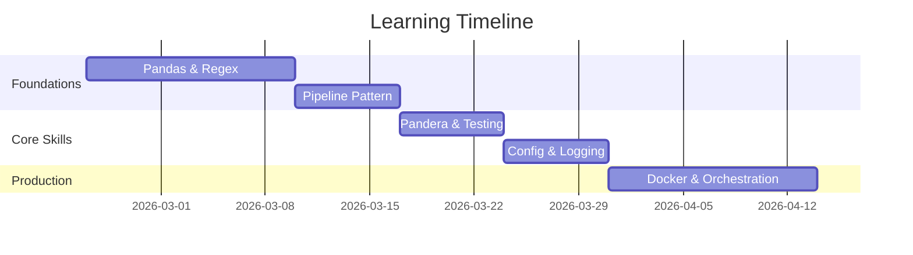
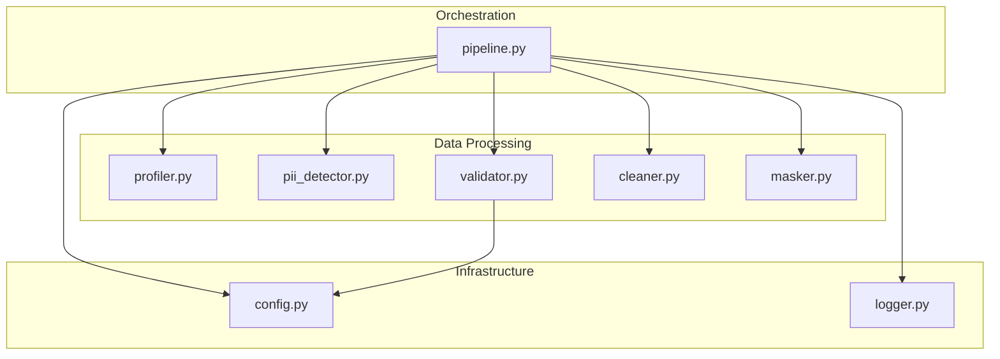

# Learning Guidance for Data Quality Validation Pipeline

This document categorizes the concepts and techniques used in this project to help you prioritize your learning.

## Learning Path Overview



---

## MUST UNDERSTAND NOW
These are foundational concepts you need to grasp immediately to work with this codebase.

### 1. Pandas DataFrame Operations
- **What**: Core data manipulation library in Python
- **Why Critical**: Every stage of data processing uses DataFrames
- **Key Operations Used**:
  - `pd.read_csv()` - loading data
  - `df.iterrows()`, `df.items()` - iteration
  - `df.isna()`, `pd.notna()` - null checking
  - `df.at[idx, col]` - cell access/update
  - `df.copy()` - avoiding mutation of original data

### 2. Regular Expressions (Regex)
- **What**: Pattern matching for strings
- **Why Critical**: Used for validation, PII detection, format normalization
- **Patterns You Must Know**:
  ```python
  r'^\d{3}-\d{3}-\d{4}$'  # Phone format XXX-XXX-XXXX
  r'^[a-zA-Z0-9._%+-]+@[a-zA-Z0-9.-]+\.[a-zA-Z]{2,}$'  # Email
  r'^\d{4}-\d{2}-\d{2}$'  # Date YYYY-MM-DD
  ```
- **Functions**: `re.match()`, `re.search()`, `re.sub()`

### 3. Python Data Classes
- **What**: `@dataclass` decorator for structured data
- **Why Critical**: Used throughout for `ValidationFailure`, `QualityIssue`, `PIIColumn`
- **Key Benefit**: Auto-generates `__init__`, `__repr__` methods

### 4. Type Hints
- **What**: `Dict[str, int]`, `List[Tuple[str, int]]`, `Optional[str]`
- **Why Critical**: Code readability and IDE support
- **Pattern**: `def function(param: Type) -> ReturnType:`

### 5. String Manipulation
- **What**: `.strip()`, `.lower()`, `.title()`, `.split()`
- **Why Critical**: Data normalization depends on these
- **Example**: Converting `"PATRICIA"` to `"Patricia"`

### 6. Pandera Schema Validation (IMPLEMENTED)
- **What**: Declarative data validation using DataFrameSchema
- **Why Critical**: Used in `src/validator.py` for all data validation
- **Key Concepts**:
  - `pa.DataFrameSchema` - defines expected structure
  - `pa.Column` - column-level constraints
  - `pa.Check` - custom validation functions
- **Example**:
  ```python
  schema = pa.DataFrameSchema({
      "email": pa.Column(str, checks=pa.Check(is_valid_email))
  })
  ```

### 7. pytest Testing (IMPLEMENTED)
- **What**: Python testing framework
- **Why Critical**: 93 tests validate all pipeline modules
- **Key Concepts**:
  - Test functions: `def test_feature():`
  - Fixtures: `@pytest.fixture` for shared setup
  - Assertions: `assert result == expected`
- **Run**: `pytest tests/ -v`

### 8. YAML Configuration (IMPLEMENTED)
- **What**: External configuration via config.yaml
- **Why Critical**: Used in `src/config.py` for all settings
- **Key Concepts**:
  - `yaml.safe_load()` - parse YAML files
  - Environment variable overrides with `DQV_` prefix
  - Priority: env vars > YAML > defaults

---

## TREAT AS BLACK BOX FOR NOW
You can use these without deep understanding. Learn the interface, not the internals.

### 1. Logging Module
- **Interface**: `logger.info("message")`, `logger.error("message")`
- **Configuration**: The `create_pipeline_logger()` function in `logger.py` handles setup
- **Features Implemented**:
  - File rotation (size-based or time-based)
  - Console output with color coding
  - Structured JSON logging option
- **Skip For Now**: Custom handlers, log aggregation

### 2. argparse
- **Interface**: `parser.add_argument('--name', default='value', help='description')`
- **Usage**: `args = parser.parse_args()` then `args.name`
- **Skip For Now**: Subparsers, mutually exclusive groups, custom types

### 3. pathlib.Path
- **Interface**: `Path(string)`, `path / 'subdir'`, `path.exists()`, `path.mkdir()`
- **Why Used**: Cross-platform path handling
- **Skip For Now**: Path resolution internals, PurePath vs Path

### 4. datetime Module
- **Interface**: `datetime.now()`, `strftime('%Y-%m-%d')`, `strptime(string, format)`
- **Skip For Now**: Timezone handling, timedelta arithmetic

### 5. Context Managers (with statements)
- **Interface**: `with open(file, 'w') as f:`
- **Know**: Automatic resource cleanup
- **Skip For Now**: `__enter__`, `__exit__` protocol

---

## PLAN TO LEARN LATER
These are important for production-quality code but not blocking for this project.

### 1. Great Expectations (Advanced Validation)
- **What**: Enterprise-grade data validation framework
- **Why Later**: Pandera already implemented; GX adds data docs and profiling
- **When**: Managing multiple data sources with complex dependencies
- **Resources**: https://docs.greatexpectations.io

### 2. Advanced Testing Techniques
- **What**: Property-based testing, mutation testing, integration tests
- **Why Later**: pytest basics already implemented (93 tests)
- **When**: Expanding test coverage beyond unit tests
- **Libraries**: `hypothesis`, `mutmut`

### 3. Exception Handling Best Practices
- **What**: Custom exceptions, exception chaining, context managers
- **Current Code**: Basic try/except with Pandera validation errors
- **Production Need**: Specific exception types, proper error propagation
- **Timeline**: When refactoring for production

### 4. Advanced Configuration
- **What**: Pydantic settings, secret management
- **Current Code**: YAML config with environment overrides implemented
- **Production Need**: Vault integration, encrypted secrets
- **Libraries**: `pydantic-settings`, `python-dotenv`, HashiCorp Vault

### 5. Async/Await for I/O
- **What**: Asynchronous programming
- **Why Later**: Scale to large datasets, parallel processing
- **Timeline**: When dealing with multiple data sources

### 6. Database Integration
- **What**: SQLAlchemy, connecting to PostgreSQL/MySQL
- **Why Later**: Production pipelines often read/write to databases
- **Timeline**: When moving beyond CSV files

### 7. Docker Containerization
- **What**: Packaging applications with dependencies
- **Why Later**: Dockerfile and docker-compose planned but not yet implemented
- **Timeline**: Next phase of production readiness

### 8. Apache Airflow / Prefect
- **What**: Workflow orchestration tools
- **Why Later**: Schedule and monitor pipeline runs
- **Timeline**: After understanding pipeline concepts

### 9. Data Privacy Laws (GDPR, CCPA)
- **What**: Legal requirements for PII handling
- **Why Later**: Compliance in production
- **Topics**:
  - Data minimization
  - Right to erasure
  - Consent management

### 10. Advanced Regex
- **What**: Lookahead, lookbehind, named groups, non-greedy matching
- **Why Later**: Complex pattern extraction
- **Timeline**: When validation patterns become complex

---

## Recommended Learning Path



**Week 1-2**: Master Pandas and Regex
- Complete Pandas exercises on Kaggle
- Practice regex on regex101.com
- Focus on `df.isna()`, `df.apply()`, `re.match()`, `re.sub()`

**Week 3**: Understand the Pipeline Pattern
- Study [src/pipeline.py](src/pipeline.py) structure
- Trace data flow through all 7 stages
- Understand the `PipelineStage` and `DataQualityPipeline` classes

**Week 4**: Study Implemented Features
- Review Pandera schema validation in [src/validator.py](src/validator.py)
- Understand pytest fixtures in [tests/conftest.py](tests/conftest.py)
- Explore config patterns in [src/config.py](src/config.py)
- Study logger rotation in [src/logger.py](src/logger.py)

**Week 5**: Run and Extend Tests
- `pytest tests/ -v` to run all tests
- Add edge case tests for your use cases
- Aim for 90%+ code coverage

**Week 6+**: Production Readiness
- Add Docker containerization
- Integrate with workflow orchestrator (Airflow/Prefect)
- Build monitoring and alerting

---

## Quick Reference: Design Patterns Used

| Pattern | Location | Purpose |
|---------|----------|---------|
| Pipeline/Chain | pipeline.py | Sequential stage execution |
| Strategy | validator.py | Pandera schema-based validation |
| Factory | DataProfiler, PIIDetector | Create analysis objects |
| Dataclass | All modules | Structured data transfer |
| Module Pattern | src/ directory | Separation of concerns |
| Configuration | config.py | Externalized settings with overrides |
| Decorator | logger.py | LogContext for timing operations |

### Pipeline Module Dependencies



---

## Code Quality Notes

The codebase follows these principles:
- Single Responsibility: Each module handles one concern
- DRY: Common patterns extracted to methods
- Explicit over Implicit: Type hints and clear naming
- Fail Fast: Validation errors raised immediately

When extending this code, maintain these patterns.
